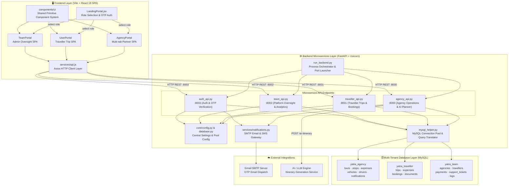
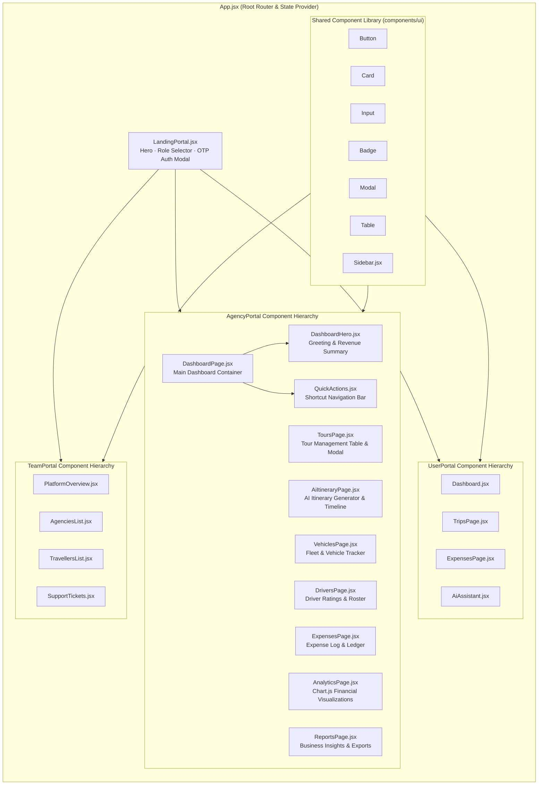
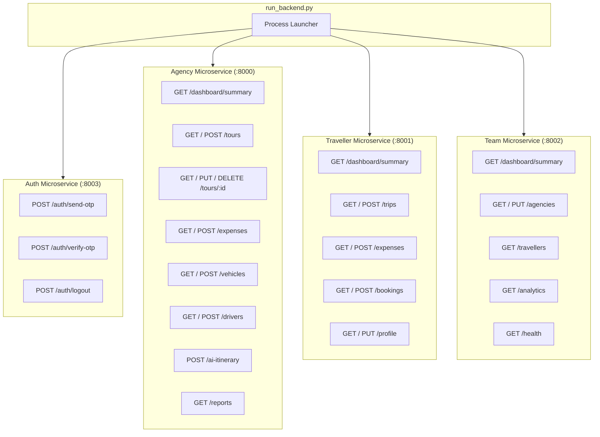
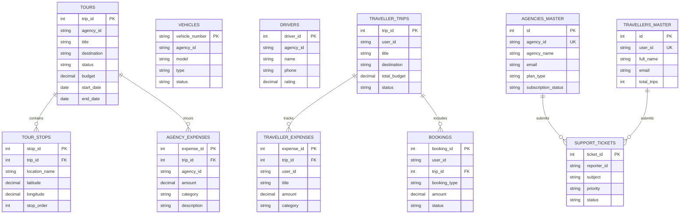
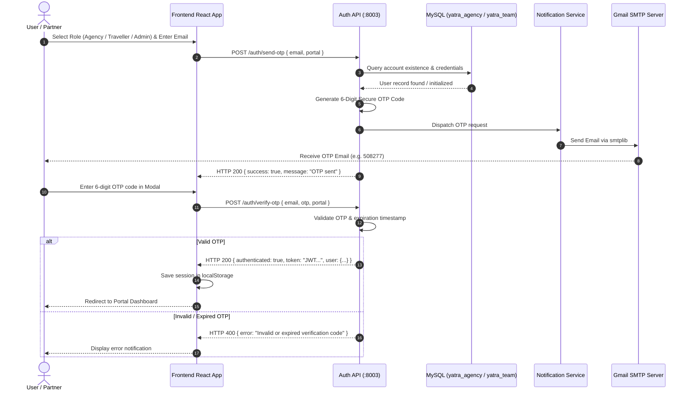
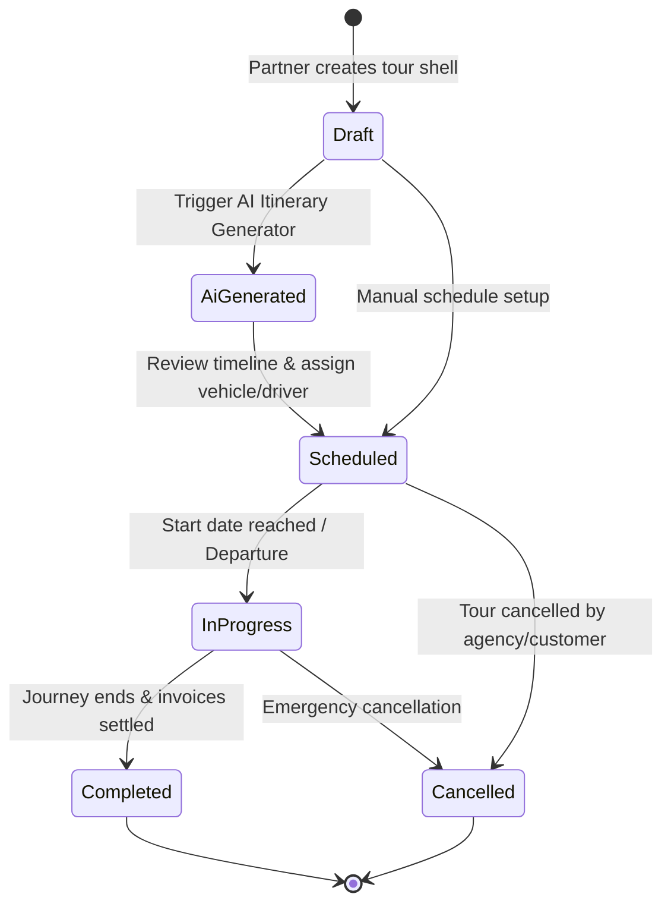

# YATRA System Architecture & Mermaid Diagrams

> Comprehensive visual documentation of the YATRA AI-Powered Travel Management Platform.

---

## 1. High-Level System Architecture

---

## 2. Frontend Component Breakdown & Routing Architecture

---

## 3. Backend Microservices Router Topology

---

## 4. Multi-Tenant Database Schema (Entity Relationships)

---

## 5. OTP Authentication & Verification Flow

---

## 6. Tour Lifecycle State Diagram

