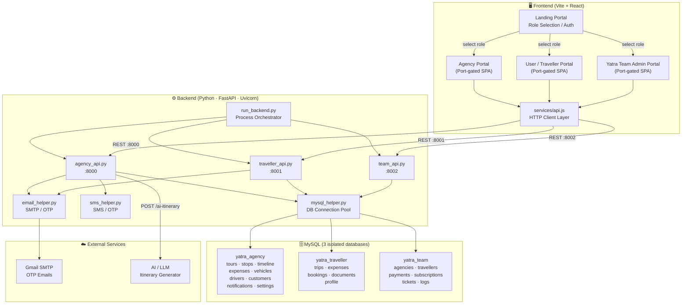
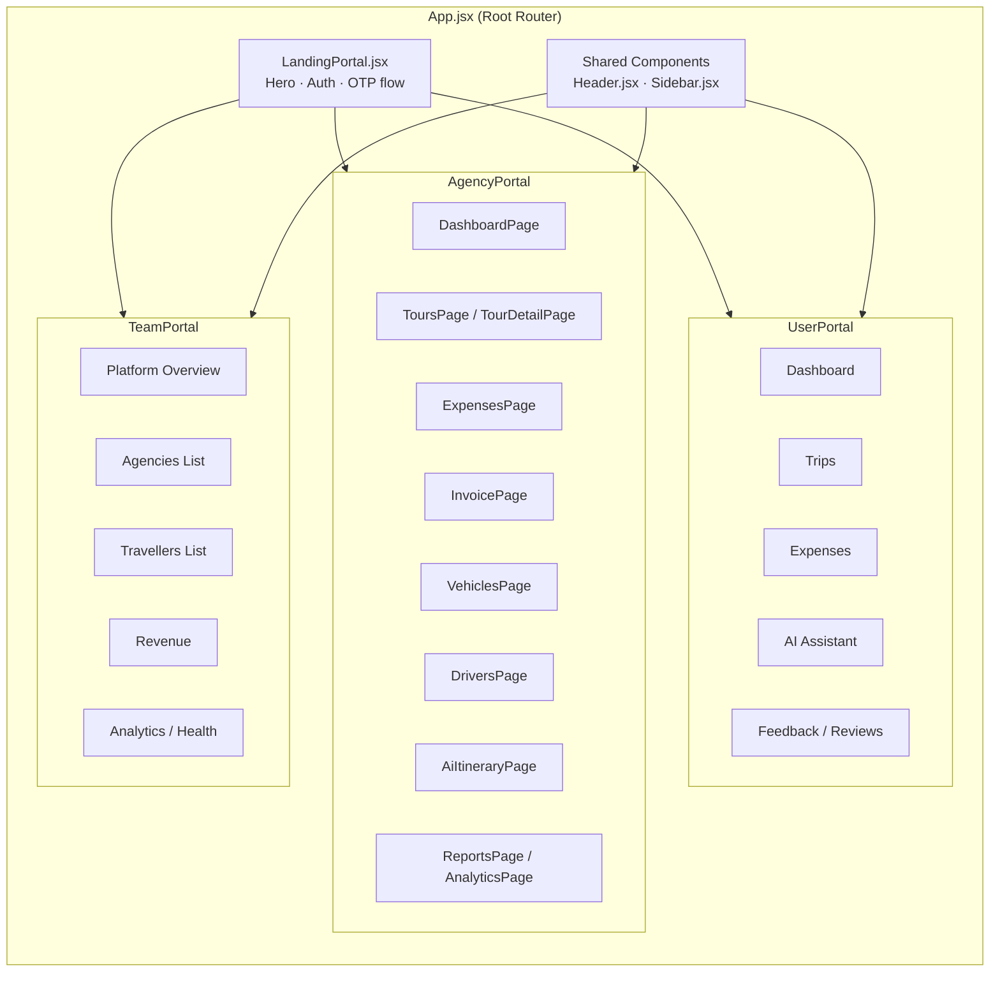
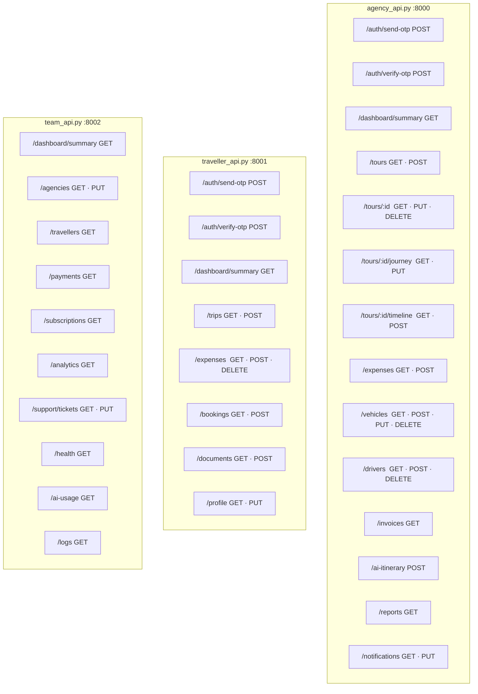
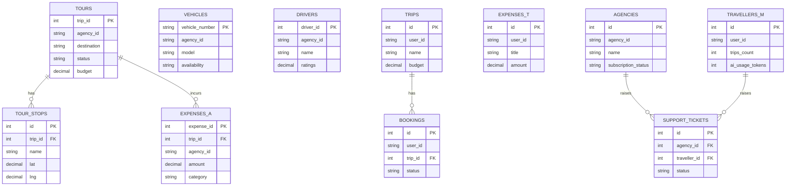
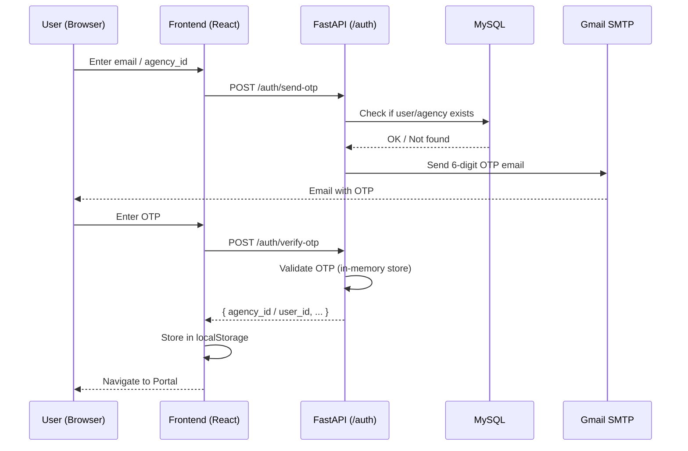

# YATRA — Architecture Diagram

> AI-powered travel management platform with three role-based portals and a microservices backend.

---

## High-Level System Architecture

---

## Frontend — Portal & Component Breakdown

---

## Backend — API Endpoints Summary

---

## Database Schema — Entity Relationships

---

## Auth Flow — OTP Login

---

## Technology Stack Summary

| Layer | Technology |
|---|---|
| **Frontend Framework** | React 18 + Vite |
| **Frontend Styling** | Vanilla CSS (custom design system) |
| **Backend Framework** | FastAPI (Python) |
| **ASGI Server** | Uvicorn |
| **Database** | MySQL (3 databases) |
| **Auth** | Email OTP (in-memory store) |
| **Email** | Gmail SMTP via `smtplib` |
| **SMS** | sms_helper (pluggable) |
| **AI** | External LLM (itinerary generation) |
| **Process Mgmt** | `run_backend.py` subprocess orchestrator |
